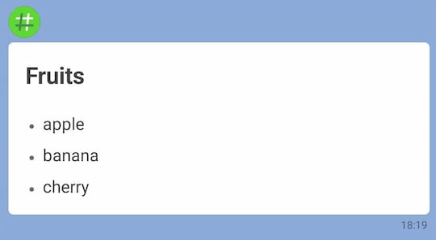
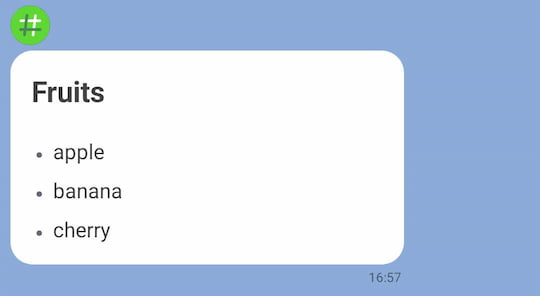
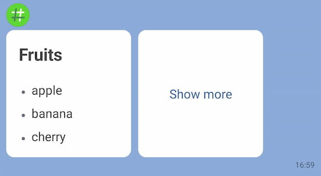

<p align="center">
  
</p>
<p align="center">
  <a href="https://badge.fury.io/js/line-markdown" rel="nofollow"></a>
  <a href="https://github.com/Arahabica/line-markdown/actions/workflows/test.yml"></a>
  <a href="https://codecov.io/gh/Arahabica/line-markdown" rel="nofollow"></a>
</p>

# line-markdown

line-markdown is a converter that transforms Markdown into Flex Message for the LINE Messaging API.

# Installation

```bash
npm install line-markdown --save
```

# Usage

## Basic usage

Convert the markdown to a Flex Message.

### Code

```js
import { convertToFlexMessage } from 'line-markdown'
import * as line from '@line/bot-sdk'

const markdownText = `
# Fruits
* apple
* banana
* cherry
`.trim()

convertToFlexMessage(markdownText)
  .then(({ flexMessage }) => {
    const client = new line.messagingApi.MessagingApiClient({
      channelAccessToken: '{{YOUR_CHANNEL_ACCESS_TOKEN}}'
    })
    return client.pushMessage({
      to: '{{YOUR_USER_ID}}',
      messages: [flexMessage]
    })
  })
  .then(() => {
    console.log('sent.')
  })
```

### Result

#### Talk List Screen

The default alternative text is `markdown`, so the talk list screen will display `markdown`.


#### Talk Screen

The default size of the Flex message bubble is `giga`.



## Custom Alternative text

To set custom alternative text and set the bubble size to mega, use the following code.

### Code

```typescript
import { convertToFlexMessage } from 'line-markdown'
import * as line from '@line/bot-sdk'

const markdownText = `
# Fruits
* apple
* banana
* cherry
`.trim()

convertToFlexMessage(markdownText, 'Fruits', { size: 'mega' })
  .then(({ flexMessage }) => {
    const client = new line.messagingApi.MessagingApiClient({
      channelAccessToken: '{{YOUR_CHANNEL_ACCESS_TOKEN}}'
    })
    return client.pushMessage({
      to: '{{YOUR_USER_ID}}',
      messages: [flexMessage]
    })
  })

```

### Result

#### Talk List Screen

The alternative text is `Fruits`.


#### Talk Screen

The size of the Flex message bubble is set to `mega`.



## Code Display

`line-markdown` also supports the display of code.

### Code

```typescript
import { convertToFlexMessage } from 'line-markdown'
import * as line from '@line/bot-sdk'

const markdownText =
  [
    '```typescript                                 ',
    'const add = (a:number, b:number): number => { ',
    '  return a + b                                ',
    '}                                             ',
    '```                                           '
  ].join("\n")

convertToFlexMessage(markdownText, 'Typescript sample')
  .then(({ flexMessage, textType }) => {
    console.log(textType) // => "code"
    const client = new line.messagingApi.MessagingApiClient({
      channelAccessToken: '{{YOUR_CHANNEL_ACCESS_TOKEN}}'
    })
    return client.pushMessage({
      to: '{{YOUR_USER_ID}}',
      messages: [flexMessage]
    })
  })
```

### Result

#### Talk List Screen


#### Talk Screen


## Flex Bubble

You can convert Markdown into a Flex Bubble, which allows you to use Markdown as part of a carousel

### Code

```typescript
import { convertToFlexBubble } from 'line-markdown'
import * as line from '@line/bot-sdk'

const markdownText = `
# Fruits
* apple
* banana
* cherry
`.trim()
convertToFlexBubble(markdownText, { size: 'micro' })
  .then(({ flexBubble }) => {
    const message = {
      type: "flex",
      altText: 'Fruits',
      contents: {
        type: 'carousel',
        contents: [
          flexBubble,
          {
            type: "bubble",
            size: "micro",
            body: {
              type: "box",
              layout: "vertical",
              justifyContent: "center",
              contents: [
                {
                  type: "button",
                  action: {
                    type: "uri",
                    label: "Show more",
                    uri: "http://linecorp.com/"
                  }
                }
              ]
            }
          }
        ]
      }
    }
    const client = new line.messagingApi.MessagingApiClient({
      channelAccessToken: '{{YOUR_CHANNEL_ACCESS_TOKEN}}'
    })
    return client.pushMessage({
      to: '{{YOUR_USER_ID}}',
      messages: [message]
    })
  })
```

### Result

#### Talk List Screen


#### Talk Screen

Markdown is applied as part of the carousel.




## Flex Box

You can convert Markdown into a Flex Box. This allows you to use Markdown as part of a Flex Bubble.

### Code

```typescript
import { convertToFlexBox } from 'line-markdown'
import * as line from '@line/bot-sdk'

const markdownText = `
# Fruits
* apple
* banana
* cherry
`.trim()
convertToFlexBox(markdownText)
  .then(({ flexBox }) => {
    const message = {
      type: "flex",
      altText: 'Fruits',
      contents: {
        type: "bubble",
        size: 'mega',
        body: {
          type: "box",
          layout: "vertical",
          contents: [
            flexBox,
            {
              type: "button",
              action: {
                type: "uri",
                label: "Show more",
                uri: "http://linecorp.com/"
              }
            }
          ]
        }
      }
    }
    const client = new line.messagingApi.MessagingApiClient({
      channelAccessToken: '{{YOUR_CHANNEL_ACCESS_TOKEN}}'
    })
    return client.pushMessage({
      to: '{{YOUR_USER_ID}}',
      messages: [message]
    })
  })
```

### Result

#### Talk List Screen


#### Talk Screen

A button is positioned below the Markdown.


## License

[MIT](https://opensource.org/licenses/MIT)
